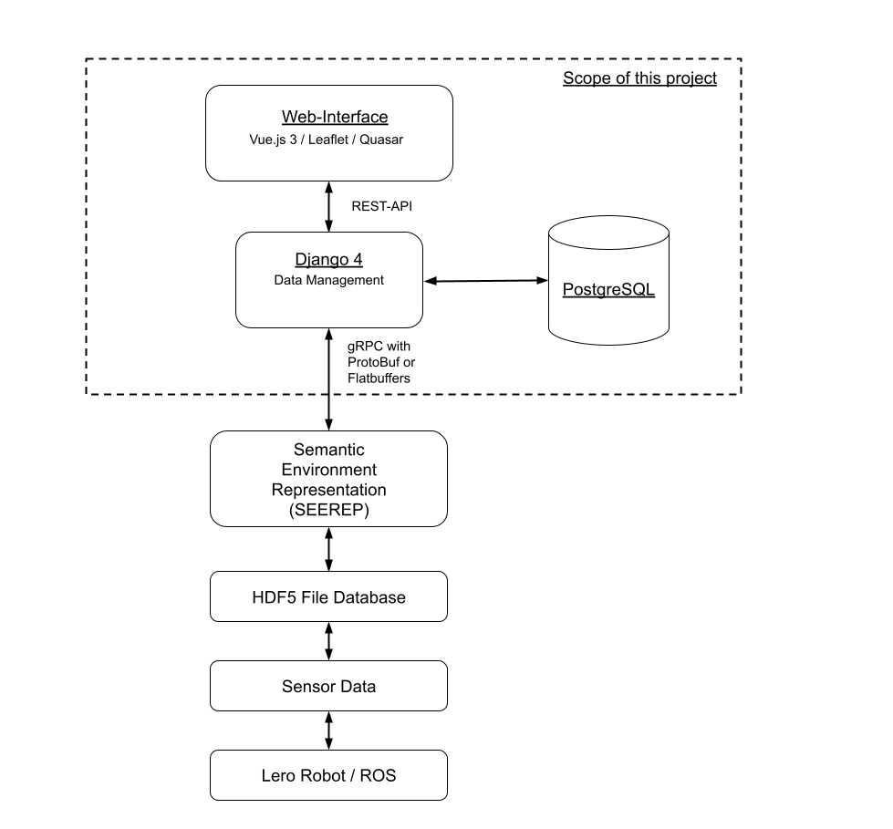

# README

<!--
The following template was used to create this README:
https://github.com/othneildrew/Best-README-Template

MIT License

Copyright (c) 2021 Othneil Drew

Permission is hereby granted, free of charge, to any person obtaining a copy
of this software and associated documentation files (the "Software"), to deal
in the Software without restriction, including without limitation the rights
to use, copy, modify, merge, publish, distribute, sublicense, and/or sell
copies of the Software, and to permit persons to whom the Software is
furnished to do so, subject to the following conditions:

The above copyright notice and this permission notice shall be included in all
copies or substantial portions of the Software.

THE SOFTWARE IS PROVIDED "AS IS", WITHOUT WARRANTY OF ANY KIND, EXPRESS OR
IMPLIED, INCLUDING BUT NOT LIMITED TO THE WARRANTIES OF MERCHANTABILITY,
FITNESS FOR A PARTICULAR PURPOSE AND NONINFRINGEMENT. IN NO EVENT SHALL THE
AUTHORS OR COPYRIGHT HOLDERS BE LIABLE FOR ANY CLAIM, DAMAGES OR OTHER
LIABILITY, WHETHER IN AN ACTION OF CONTRACT, TORT OR OTHERWISE, ARISING FROM,
OUT OF OR IN CONNECTION WITH THE SOFTWARE OR THE USE OR OTHER DEALINGS IN THE
SOFTWARE.
-->

<br />
<div align="center">
  <a href="https://github.com/othneildrew/Best-README-Template">
    
  </a>

  <h3 align="center">Project PlantMap</h3>

  <p align="center">
    A tool to support sustainable farming
    <br />
    <a href="https://github.com/naturerobots/HSOS-SEP-PlantMap-2022/wiki"><strong>Explore the Wiki»</strong></a>
    <br />
    ·
    <a href="https://github.com/naturerobots/HSOS-SEP-PlantMap-2022/issues">Report Bug</a>
    ·
    <a href="https://github.com/naturerobots/HSOS-SEP-PlantMap-2022/issues">Request Feature</a>
  </p>
</div>

## Table of Contents

- [About the project](#about-the-project)
- [Getting Started](#getting-started)
  - [Preequisites](#preequisites)
  - [Running the Application](#running-the-application)
  - [Development Container](#vs-code-development-container)
  - [GitHub Container Registry](#github-container-registry)
- [Architecture](#architecture-overview)
- [Contributing](#contributing)
  - [Pre-Commit Checks](#pre-commit-formatting-checks)
  - [Conventional Commit Messages](#conventional-commit-messages)
- [License](#license)

## About The Project

The goal of this project is to develop a platform to support sustainable
([biointensive]()) vegetable gardeners. This involves the creation of a digital
twin of the vegetable gardens to monitor various aspects like the growth and the
health of the plants. The necessary data is gathered by autonomous robots
driving around in the gardens, which are currently in development. This allows for
an early detection and treatment of diseases, as well as optimizations of yield
estimates and bed planning.

## Getting started

### Preequisites

In order to use the application you need to install:

- docker >= 20.10.16
- docker compose >= 2.5.0
- vs-code

### Running the application

If you just want to have a look at the running PlantMap application, you can run
`docker compose` in the root folder. For that use, the following steps:

```sh
git clone https://github.com/naturerobots/HSOS-SEP-PlantMap-2022.git
cd HSOS-SEP-PlantMap-2022
docker-compose run (Windows, Mac)
docker compose run (Linux)
```

The web-page should now be available at
[http://localhost:80](http://localhost:80) and the REST-API at
[http://localhost:8000](http://localhost:8000)

### VS-Code Development Container

1. Clone this repository and open it in VS Code.

   ```sh
   git clone https://github.com/naturerobots/HSOS-SEP-PlantMap-2022.git
   cd HSOS-SEP-PlantMap-2022
   code .
   ```

2. Install the `ms-vscode-remote.remote-containers` and
   `ms-azuretools.vscode-docker` extensions.

   ```sh
   code --install-extension ms-vscode-remote.remote-containers
   code --install-extension ms-azuretools.vscode-docker
   ```

3. Press `F1` or `CTRL+SHIFT+P` and enter `Remote-Containers: Reopen Folder in Container`
4. This creates a docker container for the development of the PlantMap application and
   starts the needed [PostgreSQL](ttps://www.postgresql.org/) database. Additionally
   all necessary VS Code extensions and npm packages from the `package.json` are
   installed. Further git pre-commit hooks are set up.
5. The default user for the container is:

   ```
   user: `docker`
   password: `docker`
   ```

### GitHub Container Registry

The docker images for _vue_ and _django_ are published to the
GitHub Container Registry. In order to download them, you first need to log in:

If you have enabled 2-factor authentication, please create an access token:
[https://github.com/settings/tokens](https://github.com/settings/tokens)

Use your password or generated token and the `ghcr.io` container registry as
follows:

```bash
docker login ghcr.io -u USERNAME --password PASSWORD/TOKEN
```

Now you call pull the images with `docker pull`.

## Architecture Overview

The frontend of the PlantMap project is build with [Vue.js](https://vuejs.org/),
[Quasar](https://quasar.dev/) and [Leaflet](https://leafletjs.com/) for the
integration of maps. The [Django](https://www.djangoproject.com/) server is used
as a backend for data management. It provides a REST-API to retrieve data
from a [PostgreSQL](https://www.postgresql.org/download/) database and SEEREP.
PostgreSQL is used to store general user specific information. SEEREP provides a
semantic environment representation of the gardens and can accept
spatio-temporal-semantic queries. SEEREP is currently in development and will also
be open-sourced soon. [gRPC](https://grpc.io/) is used to query and retrieve
data from SEEREP, currently [Protocol
Buffers](https://developers.google.com/protocol-buffers) are used as the
messaging format. The data for SEEREP is recorded by an autonomous driving robot which is also developed by [naturerobots](https://naturerobots.de/).



## Contributing

Contributions are what make the open source community such an amazing place to
learn and inspire. Any contributions you make are **greatly appreciated**.

If you have a suggestion that would make this better, please fork the repo and
create a pull request. You can also simply open an issue with the tag
"enhancement". Don't forget to give the project a star!

### Pre-Commit Formatting Checks

This repository uses [pre-commit](https://pre-commit.com/) checks to verify the
code style before committing. Since the pre-commit checks are automatically
installed in the development container, commits from inside the container are
only possible if the checks succeed.

To run over all the files in the repo manually, use:

```bash
pre-commit run -a
```

If you want to set up the pre-commit checks locally, use pip:

```bash
pip3 install --user pre-commit
```

To run pre-commit automatically before committing localy, install the git hooks
(run it in the root folder of the repository:

```bash
pre-commit install
```

### Conventional Commit Messages

This repository uses [Conventional
Commits](https://www.conventionalcommits.org/en/v1.0.0/) for a more readable and
explicit commit history. A quick summary is provided here, for more details,
visit their [website](https://www.conventionalcommits.org/en/v1.0.0/).

Conventional Commits consists of an easy set of rules, which basically state
that each commit should have the following structure:

```
<type>(optional scope): <description>

[optional body]

[optional footer(s)]
```

Some accepted types are `feat`, `fix`, `build`, `docs`, `refactor`, `test`, if
their intended use cases are not obvious to you, look into the
[documentation](https://www.conventionalcommits.org/en/v1.0.0/). An example for
a conventional commit would be:

```
feat(api): create bed information endpoint
```

## License

Distributed under the BSD 3-Clause License. See `LICENSE.txt` for more
information.
