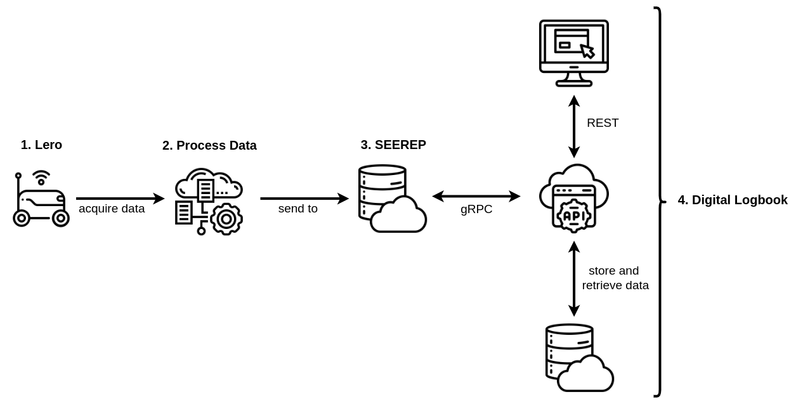

# Project Overview :satellite:

Since there are quite a lot of steps involved in the data flow, this section is
dedicated to explaining them individually.

1. The first step in creating a digital twin of the garden is the data
   acquisition. Therefore, Nature Robots is currently developing the autonomously
   navigating robot *Lero*[^1]. By using two RGB-D cameras, a point cloud as well
   as images of the bed can be recorded.

    <figure markdown>
    
        <figcaption> Lero recording data of a bed </figcaption>
    </figure>

2. After recording the data, it needs to be processed in order to extract
   information. Such information includes bounding boxes around the plants, so
   their position is known. Additionally, algorithms are being designed to
   automatically detect diseases and water deficiency.

3. The data including the extracted information is then saved in SEEREP[^2].
   SEEREP is an abbreviation for Spatio-Temporal-SEmantic Environment
   REPresentation. To put it in simple terms, it is a database which can store
   point clouds and images in addition with meta-information and semantic
   labels. The data in SEEREP can then be queried over three modalities of time,
   location and semantic meaning.

    <figure markdown>
    
        <figcaption> Overview of the complete process from the data recording to displaying them in the web-application </figcaption>
    </figure>

4. After the data is stored in SEEREP, it can be used by the **Digital
   Logbook**. The Digital Logbook consists of a backend written in Django[^3] and a
   frontend written in Vue[^4]. The two components communicate via a REST-API. The
   main task of the backend is the data management from SEEREP and the
   application specific database. The Vue frontend provides an easy to use web
   interface to access the digital twin of the garden. For more technical
   details, have a look at the [architecture
   section](reference/architecture.md).

[^1]: [Nature Robots, Lero](https://naturerobots.de/blog/lero-robot-prototype/)
[^2]: [Github, SEEREP](https://github.com/agri-gaia/seerep)
[^3]: [Django, Official Documentation](https://www.djangoproject.com/)
[^4]: [Vue, Official Documentation](https://vuejs.org/)
