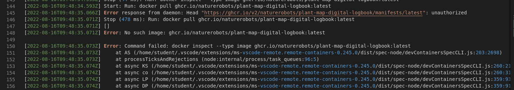
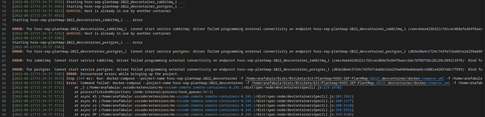

# Common Errors

This page should be used as a summary of common errors encountered while
developing the project. Have a look at it, when you're encountering some weird
problem, maybe it's listed here and if not, consider adding it.

## Problem downloading the container

Make sure you followed the steps to [log in to the GitHub Container Registry](installation.md#github-container-registry).

<figure markdown>
  {width=700px}
  <figcaption> Docker login error </figcaption>
</figure>

Be aware that the token may expire, which can lead to the error shown above.
To fix this, simply create a new token and log in again.

## Docker Compose Error

If you are having trouble starting the development container, the problem may be
that you are using the old `docker-compose` package.

After doing a `apt search docker compose` we retrieve the following result.

```bash
docker-compose/focal,focal 1.25.0-1 all
  Punctual, lightweight development environments using Docker

docker-compose-plugin/focal,now 2.6.0~ubuntu-focal amd64 [installed]
  Docker Compose (V2) plugin for the Docker CLI.

python3-ck/focal,focal 1.9.4-1.1 all
  Python3 light-weight knowledge manager
```

The `docker-compose` package is deprecated and **may not support
compose specification 3.8 if you are using a distro with old packages**. Install the `docker-compose-plugin`
package instead to solve this problem!

If you have the old `docker-compose` installed remove it with
`sudo apt remove docker-compose` and install the newer version with
`sudo apt install docker-compose-plugin`.
Now `docker compose version` should return:

```bash
Docker Compose version v2.5.0
```

If the `docker-compose-plugin` package can't be found, set up the docker
repository, use the installation guide provided
[here](https://docs.docker.com/engine/install/ubuntu/).

## Problem starting the container

The application requires the ports 5672 (for RabbitMQ), 5432 (for the PostgreSQL database),
8000 (for the backend) and 3000 (for the frontend in development mode) or
5050 (for the frontend in preview mode) to be available.

<figure markdown>
  {width=700px}
  <figcaption> Docker port error </figcaption>
</figure>

If one of these ports is already in use, the launch may fail with an error like the one shown above.

Already running docker containers may use the required ports.
To check, run the following command:

```sh
docker ps
```

The command shows a table of running docker containers.
Look in the `ports` column to see if one of them is using one of the previously mentioned ports.
If necessary, you can stop the container:

```sh
docker stop <CONTAINER ID/NAME>
```

If the port is used by another program and not a docker container,
determining which one it is [varies by operating system](https://www.startpage.com/sp/search?query=find+program+using+port).
