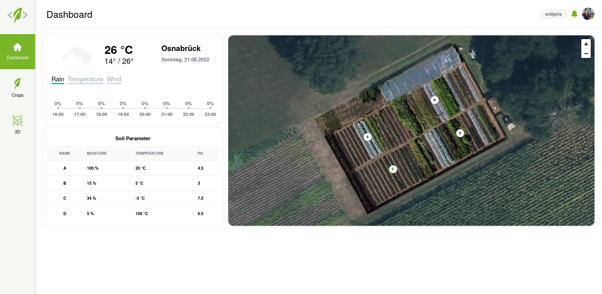
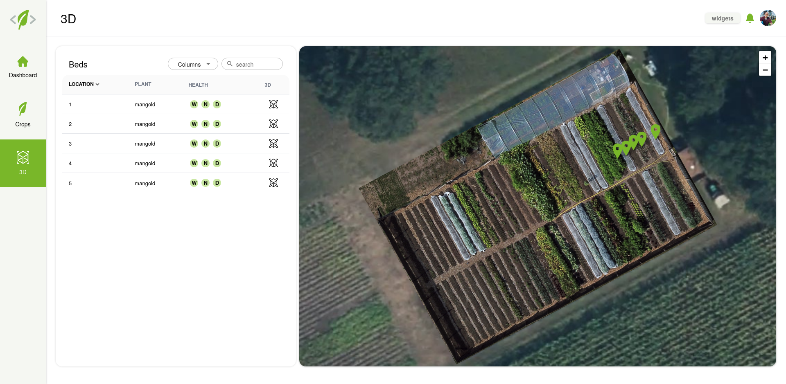
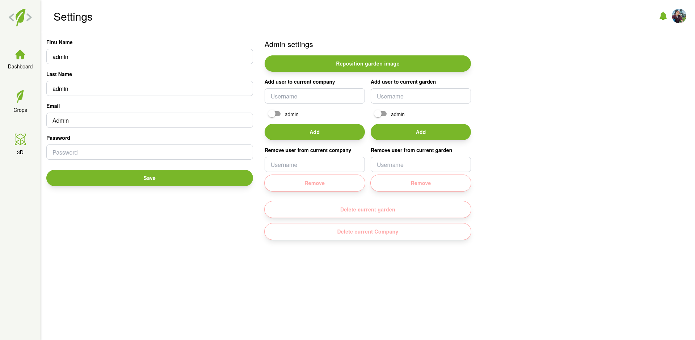

# Tutorials

After following [the steps to install and launch the application](installation.md), you can now start using it.
Begin by opening [http://localhost:3000](http://localhost:3000)
(or [http://localhost:5050](http://localhost:5050) if you are using preview mode) in a browser.

## Login :inbox_tray:

Currently, there are multiple demo accounts that come with the installation.
`Admin` and `Gardener-1` through `Gardener-4`. All of them have the password `1234`.
Each one has different permissions for different Companies and Gardens.

For an exploration of the app, it's recommended to choose the Admin account.
Simply enter the username (`Admin`) in the `Email` field and the password (`1234`) in the password field and press `login`.

## Sign up :new:

Alternatively, you can create a new account by clicking on `Sign up for free` underneath the login fields.
Simply follow the steps on screen until you reach the `Verification` step.
Since verification isn't implemented yet, just press confirm without entering anything.

Next you will be prompted to create a company and a garden.
Follow the steps on screen, and you will end up on the same dashboard as you would have with logging in.

## The main application :house_with_garden:

There are three main tabs: [`Dashboard`](#dashboard), [`Crops`](#crops) and [`3D`](#3d). Every tab consists of widgets.
Every widget can be toggled with the `widgets` button in the top right corner.
If you see an empty page, make sure some widgets are turned on.

### Changing current company and garden :arrows_clockwise:

In the application, first click on the profile picture in the top right corner, followed by `Administration`.
Select the company and garden you want and click on `save`.

### Dashboard :bar_chart:

<figure markdown>
  {width=700px}
  <figcaption> Dashboard </figcaption>
</figure>

The dashboard contains a widget showing the current and forecasted weather and a map showing the current garden.
Additionally, you can see a list titled `Soil Parameter`, which displays soil data.
Hovering over a row highlights the location of the corresponding sensor on the map.

### Crops :seedling:

<figure markdown>
  {width=700px}
  <figcaption> Crops tab </figcaption>
</figure>

The crops tab consists of a table showing the beds of the current garden.
Clicking on one of the beds shows the crops of the clicked bed in the table instead.

To the right side of the table is a map of the current garden.
Green markers show the location of all the beds listed in the table and
hovering over one of them highlights the corresponding row.
Clicking on one of the bed markers has the same effect as clicking on a bed in the table and
shows the crops of the clicked bed.

When crops are shown in the table, their locations are marked on the map in the same way as the beds locations.
Like with the beds, hovering over them on the map highlights the associated row in the table.

For both beds and crops there is a button in the `3D` column to the right of the table.
For more information, see [3D](#3d).

### 3D

<figure markdown>
  {width=700px}
  <figcaption> 3D tab </figcaption>
</figure>

The 3D tab has the same table and map as the [Crops](#crops) tab, the map is just larger.
Just like the Crops tab, beds and crops each have buttons in the `3D` column of the table.

Clicking the button brings you to a 3D model of the bed.
The model can be rotated with the left and moved with the right mouse button.
The scroll wheel can be used to zoom.

If you clicked on the `3D` button for a crop, an overlay will be shown,
framing the crop and providing additional information about it.

### Settings :gear:

<figure markdown>
  {width=700px}
  <figcaption> Settings </figcaption>
</figure>

Once you are logged in, click on the profile picture in the top right corner, and then on `Settings`.

#### Change user info

On the left side you can change user info like username and password.
Just change the displayed values and click save.

#### Manage company and garden, including permissions

The menu on the right side allows you to add or remove permissions for other users to access the current company or garden.
Additionally, if you have the required permissions, you can delete the current company and garden.
Lastly, at the top of the right side is a button to add or modify a picture of the garden that will be displayed on the map.

### Logout :outbox_tray:

To log out the current user, simply click on the profile picture and select `Logout`.
