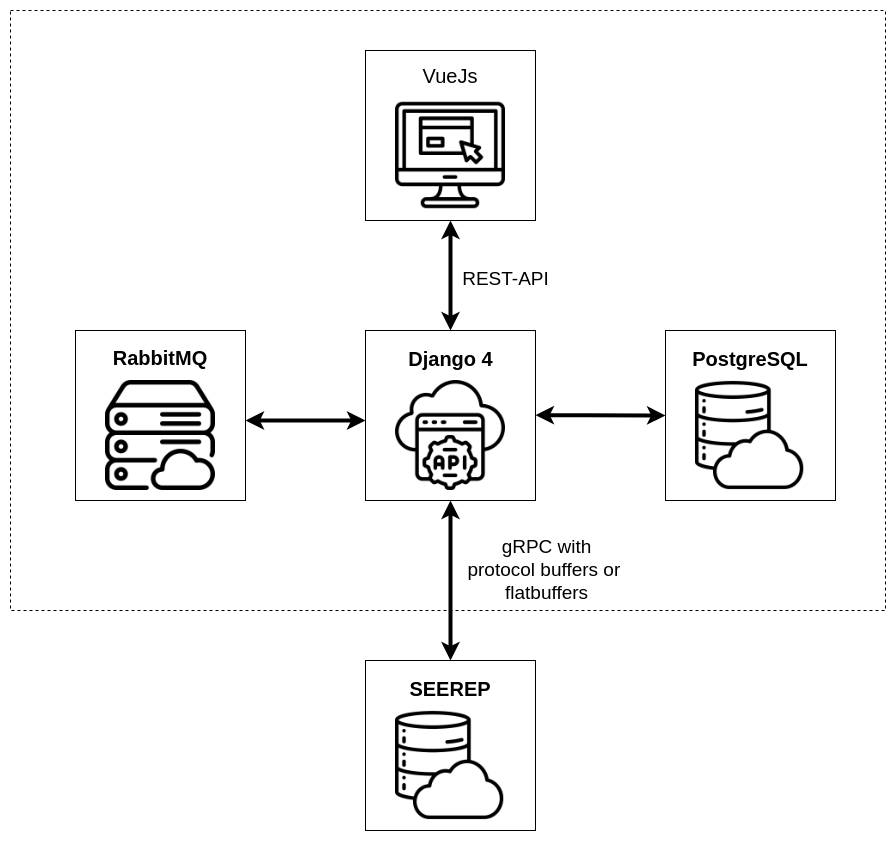
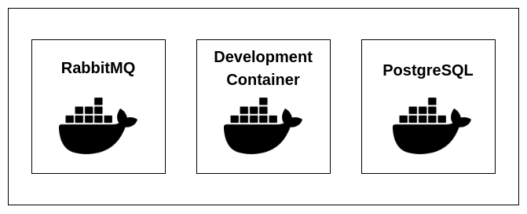

# Architecture

This section provides an overview of the software architecture as well as the
docker setup.

## Overview :bookmark_tabs:

This overview should complement the [data flow](../data-flow.md) description and
goes into more technical detail. The Django 4 server combines all componentens
into a single REST-API, which is then used by the VueJs frontend. Django uses
gRPC with Protocol Buffers to querry SEEREP for for scalar data. Protocol
Buffers is a language and platform neutral mechanisem for serializing data
developed and open-sourced by Google . It's equivalent to JSON, except it's more
efficient and much faster.

Since downloading the point clouds from SEEREP every time a request for them
would be passed to the django server would take to long due to their seize In
oder to create a satisfactory experience they are cached locally. For that the
RabbitMQ message broker serves forhandling asynchrones tasks to download the
point clouds in predetermined time intervals.

The PostgreSQL database is uesd by Django to store general information like the
user data as well as their access reights. In addition to that coordinates for
the beds are stored so that they can be accuretly displayed on a satellite
image.

<figure markdown>
{width=600px}
    <figcaption> Overview of the software architecture </figcaption>
</figure>

## Docker Setup :whale:

The Digital Logbook is split into three Docker containers. We use a Visual
Studio Code development container as an preconfigured development environment.
In the development container often abbreviated to dev-container, developers can
work on the Django and VueJs compontens of the Digital Logbook. The Docker image
for that can be downloaded from the Github container reqistry of the repository.
RabbitMQ 3.10.7 and PostgreSQL 14 are the standart images from Docker
Hub.

<figure markdown>
{width=500px}
    <figcaption> Docker setup of the PlantMap Digital Logbook</figcaption>
</figure>